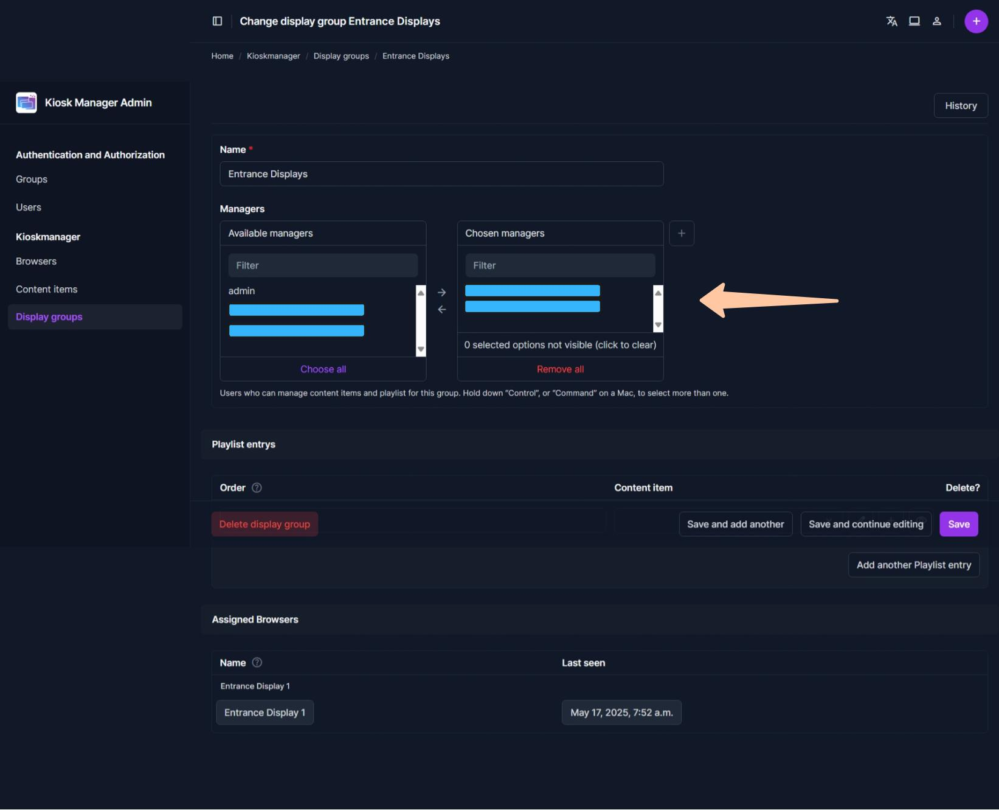

# Connecting & Managing Displays (Browsers)

Each screen or browser that will show Kioskmanager content needs to be recognized by the system. This allows you to assign specific content playlists to it.

## How New Displays Connect

Display registration is an automatic process:

1.  **Access the Player URL:** On the device intended as a display (e.g., a kiosk, smart TV browser, or a computer's web browser), navigate to the Kioskmanager player URL. This is typically the main address of your Kioskmanager instance (e.g., `http://kiosk.yourdomain.com/` or `http://kiosk.yourdomain.com/play/`).
2.  **Automatic Registration:** Upon first visit, the browser generates a unique identifier (UUID) for itself and communicates this to the Kioskmanager server. The server automatically creates a new "Browser" record using this UUID.
3.  **Initial State:** Initially, this newly registered browser will not be assigned to any Display Group and will likely show default content or a "no content assigned" message, depending on the player's configuration.

## Finding and Identifying New Displays

As an administrator, you'll need to find these automatically registered browsers in the admin panel to manage them.

1.  **Log in:** Access the [Kioskmanager Admin Panel](../getting-started.md).
2.  **Click on Browsers**
3.  **Locate the New Browser:** You will see a list of all registered browsers.
    * Look for entries with a long, unique **Identifier** (UUID format, e.g., `a1b2c3d4-e5f6-7890-1234-567890abcdef`).
    * The "Name" field will likely be empty for new, unconfigured browsers.
    * The "Last seen" timestamp can help identify recently connected displays.
    * *Tip:* Your player page briefly shows the Browser ID on connection (status overlay), you can use that to match.

## Naming and Configuring a Display

Once identified, you should give the display a human-readable name and assign it to a Display Group.
  
1.  **Select the Browser:** Click on the UUID (Identifier) of the browser you wish to configure from the list. This will take you to the "Change browser" page.  
  
2.  **Assign a Name (1):** In the "Name" field, enter a descriptive name that helps you identify this specific display (e.g., "Lobby Main Screen", "Meeting Room A Display", "Floor 2 - West Wing Kiosk").
3.  **Assign to a Group (2):**
    * Locate the "Group" field. For new displays, it will likely show `---------` (meaning no group is assigned).
    * Click the dropdown menu or the magnifying glass icon. A pop-up or list will appear showing available Display Groups.
    * Select the desired Display Group. (If you need to create a new group, you'll do that under the "Display groups" section first – see the [Create display groups guide](./create-display-groups.md) for details on creating groups, though admins can also do this).
4.  **Save Changes:** Scroll to the bottom of the page and click "Save".

The display device, upon its next communication with the server (usually within a few seconds or at the start of the next content loop), will pick up its new name (for logging/identification on the server) and start playing the content assigned to its new Display Group.# Connecting & Managing Displays (Browsers)

Each screen or browser that will show Kioskmanager content needs to be recognized by the system. This allows you to assign specific content playlists to it.

# Allow Content Managers to assign content to Display groups

You need to assign users to display groups to allow them to assign content to them.  

1. **Select Display group:** Go to `Display groups` and select the one you want to assign a user to.  

2. **Select content managers:** Add all users which should be able to assign content to that display group using the arrow buttons.
