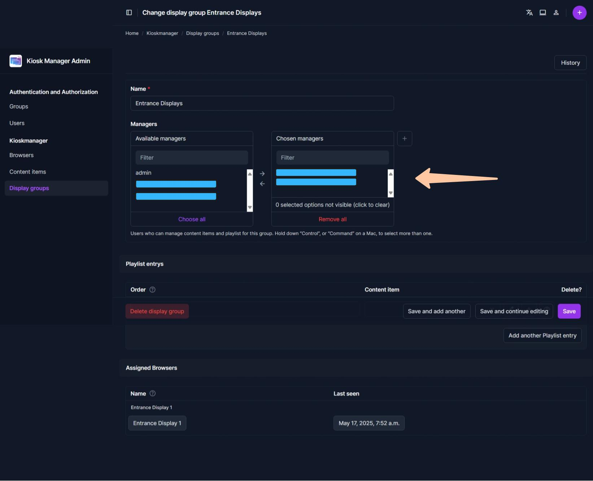

# Creating a New Display Group
A **Display Group** is a way to categorize your screens. For example, you might have a group for "Lobby Screens," another for "Meeting Room Displays," and one for "Cafeteria TVs." Each group has its own independent playlist. Any browser (display) assigned to a group will show that group's playlist.  
  
1.  **Navigate to Display Groups:** From the admin dashboard, find your Kioskmanager application section (e.g., "PLAYER") and click "Add" next to "Display groups".
    * Alternatively, click "Display groups" to see the list, then click "Add display group" in the top right.  
  
2.  **Name the Group:** Enter a clear and descriptive "Name" for your group (e.g., "Main Entrance Loop", "Product Showcase Area").
3.  **Managers:** Add all 'normal' users here which should be able to assign content to these screens.
4.  **Save:** Click **"Save and continue editing"**. This is important because you'll add content to this group on the same page.
