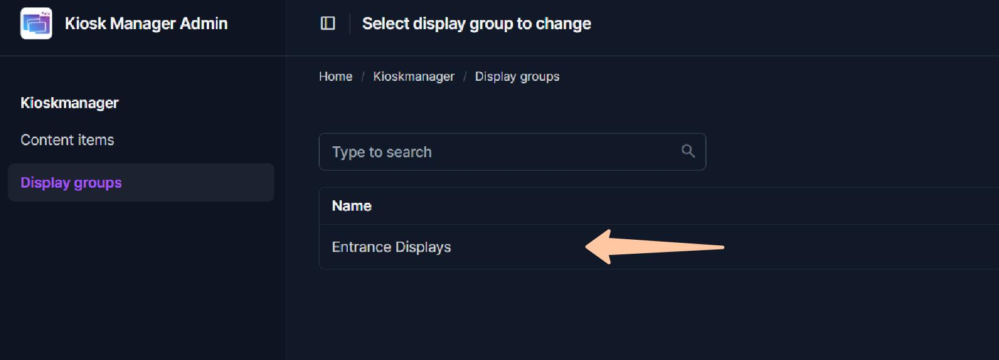
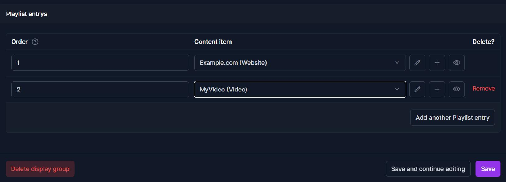

# Display/ assign content to digital signage/ kiosk screens

To diplay content on your screens you will need to create a playlist on the desried display group.
Playlists determine what content is shown on a group of displays and in what order. In Kioskmanager, playlists are managed by adding "Content Items" to "Display Groups".

First, ensure you have [Logged into the Admin Panel](../getting-started.md). You should also have some [Content Items (Videos or Websites)](./managing-content-items.md) already added to the system.

## Understanding Display Groups

A **Display Group** is a way to categorize your screens. For example, you might have a group for "Lobby Screens," another for "Meeting Room Displays," and one for "Cafeteria TVs." Each group has its own independent playlist. Any browser (display) assigned to a group will show that group's playlist.  

**Your admin need to create the display groups - see [connecting displays](../admin-guide/connecting-displays.md).**

## Building the Playlist for a Display Group

  
  
Click on your desired display group. **Your admin needs to assign your account to a display group if you miss a desired group - see [Display Groupe Guide](../admin-guide/create-display-groups.md).** Scroll down to the section titled **"Playlist Entries"**. This is where you build the ordered list of content for this group.

Each row in "Playlist Entries" represents one item in your playlist:
  
1.  **Order:** This field determines the playback sequence.
    * Enter a number (e.g., `10`, `20`, `30`). Content items with lower numbers will play first.
    * It's good practice to use increments (like 10, 20, 30 instead of 1, 2, 3) so you can easily insert new items between existing ones later without renumbering everything (e.g., you can add an item with order `15`).
2.  **Content item:** This is where you select the actual video or website.
    * Click the dropdown menu or the magnifying glass icon.
    * Search for and select the desired Content Item (which you added in [Managing Content Items](./managing-content-items.md)) from the list that appears.
3.  **Adding More Items:**
    * To add the first item, fill in the blank row provided.
    * To add subsequent items, click the "**Add another Playlist Entry**" link. A new blank row will appear.
4.  **Repeat:** For each item you want in the playlist, create a new Playlist Entry row, assign an order number, and select the Content Item.
5.  **Deleting Items:** To remove an item from the playlist, check the "DELETE?" box on its row. The item will be removed from this playlist when you save (it will not be deleted from the system's Content Item library).
6.  **Save the Playlist:** Once you have arranged all your content items in the desired order, scroll to the bottom of the page and click **"Save"**.

The displays assigned to this Display Group will now begin playing this new playlist. Videos will play to completion, and websites will display for their configured duration before the player advances to the next item in the ordered loop.
