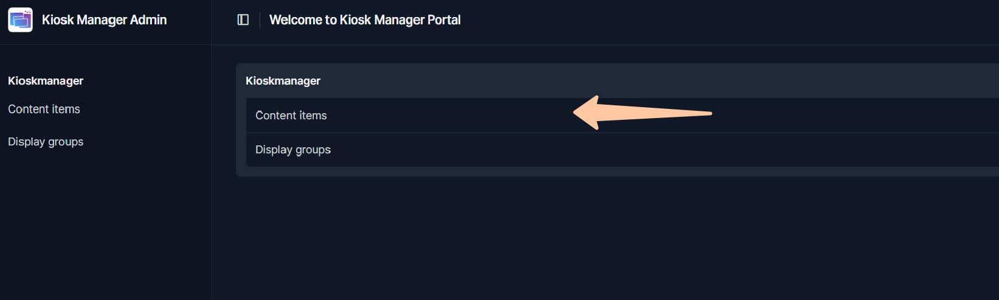
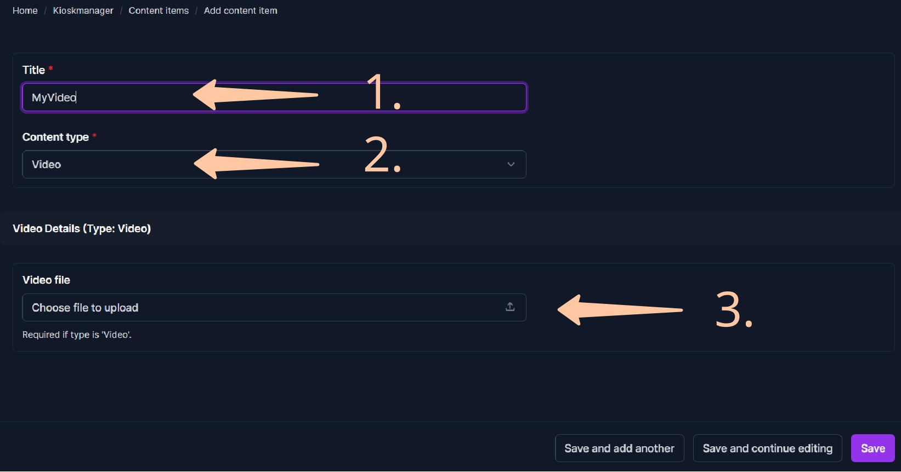
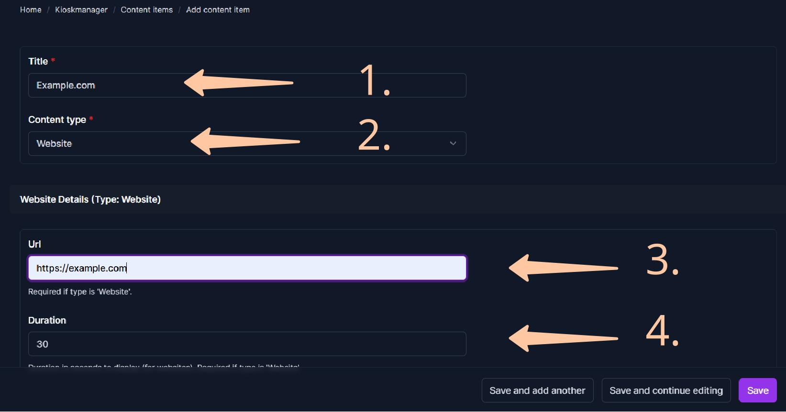

# Managing Content Items (Videos & Websites)

Content Items are the individual pieces of media that form the building blocks of your playlists. Kioskmanager supports two main types: Videos and Websites.

First, ensure you have [Logged into the Admin Panel](../getting-started.md).

## Adding a Video

1.  **Navigate to Content Items:** From the admin dashboard
click "Add" next to "Content items".
    * Alternatively, click "Content items" to see the list of existing items, then click "Add content item" in the top right.  

2.  **Enter Video Details:**
    * **Title (1):** Provide a clear, descriptive title for the video (e.g., "Company Overview Q3 2025", "New Product Launch Teaser").
    * **Content type (2):** Select **"Video"** from the dropdown menu.
    * **Video file (3):** The "Video Details" section will appear. Click "Choose File" (or similar button) and select the video file (e.g., `.mp4`, `.webm`, `.ogv`) from your computer. The file will be uploaded when you save.
3.  **Save:** Click "Save" at the bottom of the page.

Your video is now uploaded and available in the system to be added to playlists.

## Adding a Website

1.  **Navigate to Content Items:** As described in "Adding a Video".  

2.  **Enter Website Details:**
    * **Title (1):** Give the website a descriptive title (e.g., "Company News Feed", "Live Weather - Halle", "Event Calendar").
    * **Content type (2):** Select **"Website"** from the dropdown menu.
    * **Url (3):** The "Website Details" section will appear. In the "Url" field, enter the complete web address (e.g., `https://www.example.com/live-updates`).
        * *Important:* Ensure the target website allows itself to be embedded in an iframe. Some websites have security settings (like `X-Frame-Options`) that prevent this. Test the URL in an iframe separately if unsure.
    * **Duration (4):** Enter the number of **seconds** this website should be displayed each time it appears in a playlist loop (e.g., `30` for 30 seconds, `300` for 5 minutes).
3.  **Save:** Click "Save".

The website link is now registered in the system and can be [added to playlists](creating-playlists.md) to be displayed on several kiosk/ signage screens.