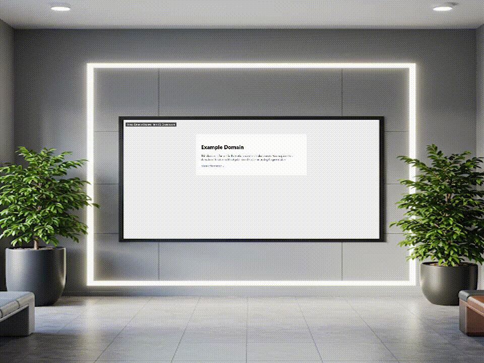

---
# https://vitepress.dev/reference/default-theme-home-page
layout: home

hero:
  name: "Kioskmanager"
  text: "Digital Signage Content Management"
  tagline: Efficiently manage and deploy content (videos, websites) to multiple displays.
  image:
    src:  /kioskmanager.png
    alt: Kioskmanager
  actions:
    - theme: brand
      text: Content Manager Guide
      link: /content-manager-guide/ # Links to content-manager-guide/index.md
    - theme: alt
      text: Admin Guide
      link: /admin-guide/ # Links to admin-guide/index.md

features:
  - title: Centralized Content
    details: Upload videos and websites through a user-friendly admin panel.
    icon: 🕹️
  - title: Display Grouping
    details: Organize displays into groups and assign targeted content playlists.
    icon: 🖥️
  - title: Role-Based Access
    details: Secure user management with permissions for content managers.
    icon: 🔐
  - title: Easy Deployment
    details: Helm chart for straightforward Kubernetes deployment.
    icon: 🚀
---
  
 
 

  

